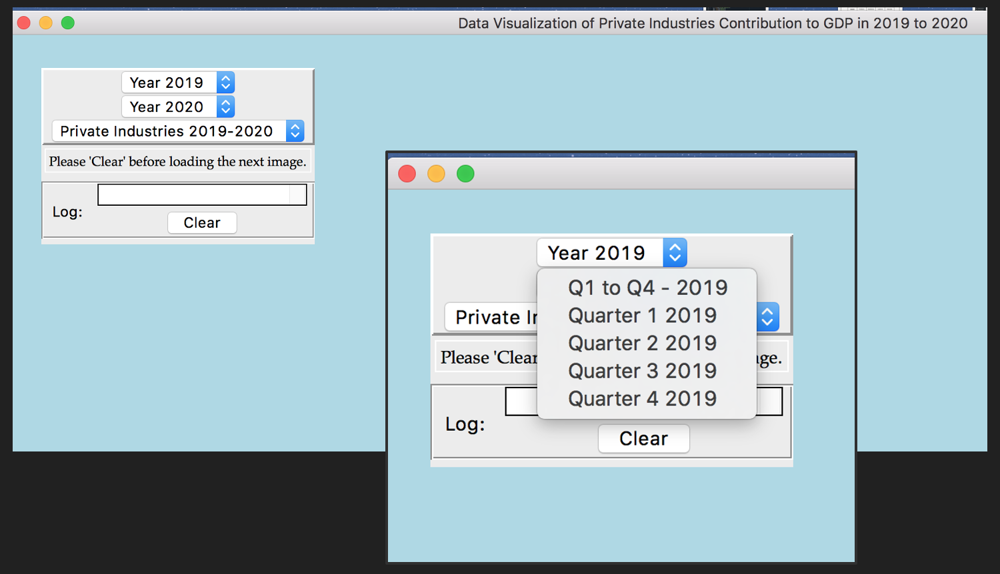
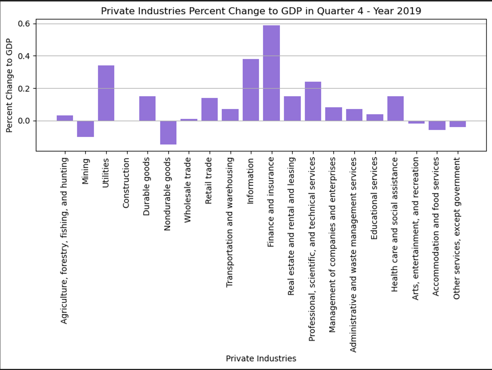
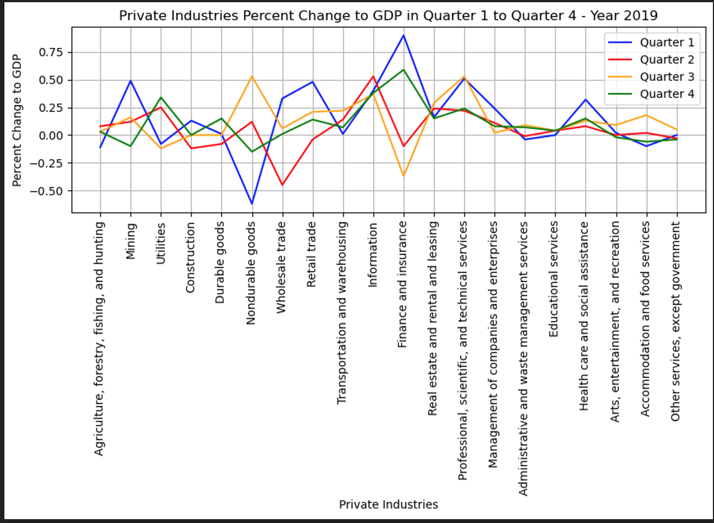

# Visualizing Economic Performance - GUI

This project is centered around building GUI window on Python for data visualization of economic performance in private sectors.

## Table of Contents
* [General Information](#general-information)
* [Technologies Used](#technologies-used)
* [Screenshots](#screenshots)
* [Setup](#setup)
* [Project Status](#project-status)
* [Room for Improvement](#room-for-improvement)

## General Information
Purpose
- To find out how different sectors of private industries performed during years 2019 to 2020. 
- Did the private industries in the United States perform better or worse throughout 2020? 

Output
- Bar chart and line graphs that is displayed on a GUI window

Data Source
- Data is obtained from the U.S. Bureau of Economic Analysis website. 
- Link to source of our data is https://www.bea.gov/data/gdp/gdp-industry 

Modules
1) main.py 
2) utilities.py

Functions 
- Total of 25 functions; 11 for our data, 13 for our GUI
- The functions : 
  - compares the entire private industries from 2019 to 2020,
  - compares Q1, Q2, Q3 and Q4 of each/individual private industry for year 2019 and year 2020
  - visualizes the performance of each industry by its quarter eg. Q1 of 2019, Q2 of 2020 etc.

Packages 
1) tkinter
2) pandas
3) matplotlib

## Technologies Used
- Python - version 3.9
- Anaconda

## Screenshots

## Setup
- Install Python: https://www.python.org/downloads/
- Install Anaconda: https://www.anaconda.com/
- After installation, run codes on _main.py_ file to used GUI for data visualization of economic performance

## Project Status
Project is: _complete_

## Room for Improvement
Areas that require improvement:
- Do some hypothesis testing & more analysis
- Add in descriptions for each graph

Areas dissatisfied:
- Unable to iterate row by row in the data frame to obtain the best/worst performing sector(s)
